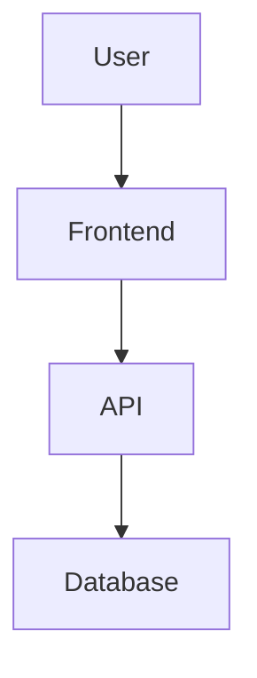

# Vibe Coding Pipeline Skill

Complete workflow for discovering innovative AI coding ideas from social media, extracting actionable insights, and generating professional design proposals.

## Quick Start

```bash
# In Claude Code
/vibe-coding-pipeline

# Or with options
/vibe-coding-pipeline --platform xhs --min-score 0.8
```

## What This Skill Does

1. **Crawls** social media (XHS, Bilibili) for vibe coding content
2. **Analyzes** content to extract innovative ideas and assess feasibility
3. **Generates** detailed technical design proposals for high-scoring ideas
4. **Exports** prioritized implementation queue for handoff

## Architecture

```
┌─────────────────────────────────────────────────────────────┐
│  Claude Code Skill: /vibe-coding-pipeline                   │
└─────────────────────────────────────────────────────────────┘
                            ↓
┌─────────────────────────────────────────────────────────────┐
│  Phase 1: Crawl                                             │
│  - Run run_vibe_coding.py                                   │
│  - Collect content from platforms                           │
│  - Save to vibe_coding_raw_data (status=pending)            │
└─────────────────────────────────────────────────────────────┘
                            ↓
┌─────────────────────────────────────────────────────────────┐
│  Phase 2: Analysis                                          │
│  - Fetch pending items from database                        │
│  - Use Claude API to analyze each item                      │
│  - Extract: innovation_score, key_ideas, technical_stack    │
│  - Update database (status=analyzed)                        │
└─────────────────────────────────────────────────────────────┘
                            ↓
┌─────────────────────────────────────────────────────────────┐
│  Phase 3: Design                                            │
│  - Fetch high-scoring items (innovation_score >= 0.7)       │
│  - Generate comprehensive design proposals                  │
│  - Save as markdown files                                   │
│  - Update database (status=design_generated)                │
└─────────────────────────────────────────────────────────────┘
                            ↓
┌─────────────────────────────────────────────────────────────┐
│  Phase 4: Export                                            │
│  - Generate SUMMARY.md (overview + top 10 ideas)            │
│  - Generate QUEUE.json (prioritized implementation list)    │
│  - Ready for handoff to implementation team                 │
└─────────────────────────────────────────────────────────────┘
                            ↓
┌─────────────────────────────────────────────────────────────┐
│  OpenClaw Integration                                       │
│  - Read QUEUE.json                                          │
│  - Pass designs to implementation projects                  │
│  - Track implementation status                              │
└─────────────────────────────────────────────────────────────┘
```

## Usage Examples

### Full Pipeline

```bash
/vibe-coding-pipeline
```

Runs all 4 phases sequentially.

### Individual Phases

```bash
# Just crawl new data
/vibe-coding-pipeline --phase crawl --platform xhs

# Analyze pending items
/vibe-coding-pipeline --phase analyze --limit 20

# Generate designs for high-scoring items
/vibe-coding-pipeline --phase design --min-score 0.8

# Export summary and queue
/vibe-coding-pipeline --phase export
```

### With Filters

```bash
# Focus on specific category
/vibe-coding-pipeline --phase analyze --category "AI-assisted coding"

# Higher quality threshold
/vibe-coding-pipeline --min-score 0.85

# Process more items
/vibe-coding-pipeline --limit 100
```

## Parameters

| Parameter | Default | Description |
|-----------|---------|-------------|
| `--phase` | `all` | Phase to run: `crawl`, `analyze`, `design`, `export`, or `all` |
| `--platform` | `xhs,bili` | Comma-separated platforms to crawl |
| `--min-score` | `0.7` | Minimum innovation score for design generation (0-1) |
| `--category` | (all) | Filter by trend category |
| `--limit` | `50` | Max items to process per phase |
| `--output-dir` | `./vibe_coding_designs` | Output directory for designs |
| `--continue-on-error` | `false` | Continue pipeline even if a phase fails |

## Output Structure

```
vibe_coding_designs/
├── SUMMARY.md                          # Overview report
├── QUEUE.json                          # Prioritized implementation queue
├── xhs_123456_design.md               # Individual design proposals
├── bili_789012_design.md
├── analysis_results.json              # Raw analysis data
└── logs/
    └── pipeline_20260317_143022.log   # Execution log
```

## Database Schema

The skill interacts with the `vibe_coding_raw_data` table:

```sql
CREATE TABLE vibe_coding_raw_data (
  platform TEXT,
  content_id TEXT,
  title TEXT,
  description TEXT,
  content_url TEXT,
  vibe_coding_keywords TEXT[],
  trend_category TEXT,
  innovation_score FLOAT,           -- Set by Phase 2
  extracted_ideas JSONB,            -- Set by Phase 2
  top_comments JSONB,
  analysis_status TEXT,             -- pending → analyzed → design_generated
  design_proposal_id TEXT,          -- Set by Phase 3
  UNIQUE(platform, content_id)
);
```

## Analysis Output Format

Phase 2 produces structured analysis:

```json
{
  "innovation_score": 0.85,
  "feasibility_score": 0.80,
  "impact_score": 0.75,
  "key_ideas": [
    "Use Cursor + v0 for rapid prototyping",
    "AI-generated components with real-time preview",
    "One-click deployment to Vercel"
  ],
  "technical_stack": ["Cursor IDE", "v0.dev", "Next.js 14", "Vercel"],
  "use_cases": [
    "Indie developers building MVPs",
    "Agencies creating client prototypes"
  ],
  "implementation_complexity": "Medium",
  "summary": "AI-powered rapid prototyping workflow for indie developers"
}
```

## Design Proposal Format

Phase 3 generates comprehensive proposals:

```markdown
# [Project Name]

## Executive Summary
One-paragraph overview...

## Problem Statement
What pain point does this solve?

## Proposed Solution
Detailed approach...

## Technical Architecture


## Implementation Plan
### Phase 1: MVP (Week 1-2)
- [ ] Task 1
- [ ] Task 2

### Phase 2: Enhancement (Week 3-4)
...

## Technology Stack
- Frontend: Next.js 14, Tailwind CSS, shadcn/ui
- Backend: Supabase, Vercel Functions
- AI: Claude API, Cursor IDE
- Deployment: Vercel

## User Stories
- As a developer, I want to...

## Success Metrics
- 100 active users in month 1
- 80% user satisfaction

## Risks & Mitigations
| Risk | Likelihood | Impact | Mitigation |
|------|------------|--------|------------|
| ... | ... | ... | ... |

## Next Steps
1. Set up project repository
2. Initialize Next.js app
3. ...
```

## OpenClaw Integration

### Calling from OpenClaw

```python
# In your OpenClaw workflow
result = openclaw.run_skill("vibe-coding-pipeline", {
    "phase": "all",
    "platform": "xhs,bili",
    "min_score": 0.75,
    "output_dir": "./designs/batch_001"
})

# Check results
print(f"Crawled: {result.stats['crawled']}")
print(f"Analyzed: {result.stats['analyzed']}")
print(f"Designed: {result.stats['designed']}")
```

### Handoff to Implementation

```python
# Read implementation queue
with open("vibe_coding_designs/QUEUE.json") as f:
    queue = json.load(f)

# Process top priority items
for item in queue[:5]:  # Top 5
    design_path = f"vibe_coding_designs/{item['design_file']}"

    # Pass to implementation project
    openclaw.run_project("ai-product-builder", {
        "design_file": design_path,
        "target_repo": f"./products/{item['content_id']}"
    })
```

## Troubleshooting

### No items collected in crawl phase

**Check**:
1. `vibe_coding/config.py` - Is `ENABLE_VIBE_CODING_COLLECTION = True`?
2. Platform cookies - Are they valid?
3. Keywords - Run `/vibe-coding-pipeline --list-keywords` to verify

**Fix**:
```python
# Lower threshold temporarily
KEYWORD_SCORE_THRESHOLD = 3  # in vibe_coding/config.py
```

### Analysis phase fails

**Check**:
1. Claude API key - Is it set in environment?
2. Rate limits - Are you hitting API limits?

**Fix**:
```bash
# Process in smaller batches
/vibe-coding-pipeline --phase analyze --limit 10
```

### Design proposals are too generic

**Fix**:
1. Increase `--min-score` to focus on higher quality ideas
2. Review and refine design prompt template in `pipeline.py`
3. Include more top comments for context

## Best Practices

1. **Run crawl daily** to keep data fresh
2. **Batch analyze weekly** to avoid rate limits
3. **Review designs manually** before implementation
4. **Track implemented ideas** in database
5. **Iterate on prompts** based on output quality

## Development

### Testing Individual Phases

```bash
# Test crawl
python .claude/skills/vibe-coding-pipeline/pipeline.py --phase crawl --platform xhs

# Test analysis (mock mode)
python .claude/skills/vibe-coding-pipeline/pipeline.py --phase analyze --limit 5

# Test design generation
python .claude/skills/vibe-coding-pipeline/pipeline.py --phase design --min-score 0.7
```

### Adding New Platforms

1. Add platform to `vibe_coding/config.py`:
   ```python
   VIBE_CODING_PLATFORMS = ["xhs", "bili", "dy", "wb"]
   ```

2. Ensure platform store factory wraps with `VibeCodingStoreWrapper`

3. Test crawl:
   ```bash
   /vibe-coding-pipeline --phase crawl --platform dy
   ```

## Files

- `skill.md` - Skill documentation and prompt templates
- `agent.md` - Agent behavior and capabilities
- `pipeline.py` - Main implementation script
- `README.md` - This file

## License

Follows main project license (NON-COMMERCIAL LEARNING LICENSE 1.1)
